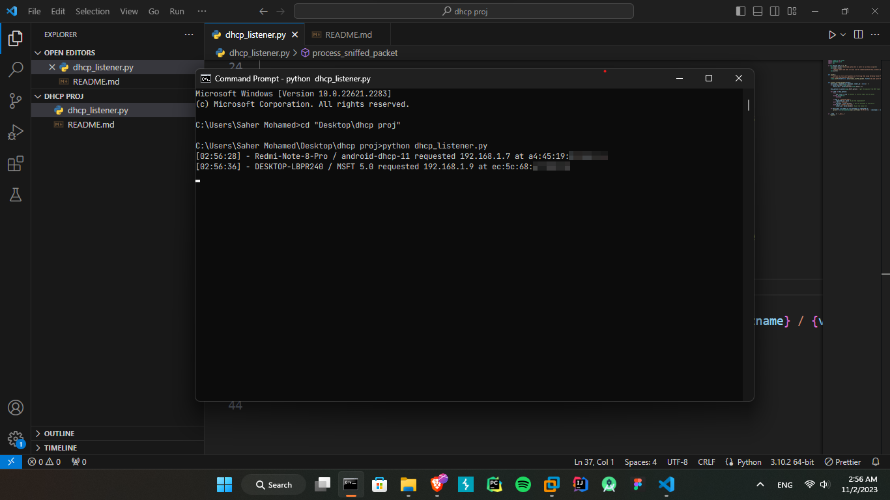

# DHCP Listener

<p align="center">
  
</p>

    

<hr />
In this Python script, is a network packet sniffer that captures DHCP (Dynamic Host Configuration Protocol) packets on your network and extracts information from these packets, such as the hostname, vendor ID, requested IP address, and the device's MAC address. It can help you monitor and log DHCP activity on your network.

## Prerequisites
- Python 3.0 or later
- `scapy` library

## Usage
- Make sure you have Python 3.0 or later installed on your system. If not, please update your Python version.

- Run the script using the following command:

    ```shell
    python3 dhcp_listener.py
    ```

The script will start sniffing network packets and filtering them using the Berkeley Packet Filter (BPF) syntax. It captures UDP packets on port 67 (DHCP server) and port 68 (DHCP client).

When a DHCP packet is detected, the script extracts information from the packet and displays it in the following format:

```bash
[07:34:56] - MyDevice / VendorXYZ requested 192.168.1.100 at 00:11:22:33:44:55
```

## Screenshot


## Features
1. Monitors and logs DHCP activity on your network.

2. Extracts and displays relevant information from DHCP packets.

3. Provides a timestamp for each DHCP request.

4. Works with Python 3.0 and later.

## Acknowledgments
This script uses the `Scapy` library for packet sniffing.

**Note:** Running a packet sniffer on a network may raise privacy and security concerns. Make sure you have the necessary permissions and legal rights to monitor network traffic.
